Hi,

First Step-By-Step !


This guide will show you how to configure ISA 2006 for coexistence of Exchange 2003 with Exchange 2010 remote connectivity services, including:


- Outlook Web Access & Outlook WebApp
- Microsoft ActiveSync
- RPCoverHTTP - Outlook Anywhere
- Publishing Exchange 2010 FARM - two client access servers

This guide assumes that:

- ISA 2006 is configured to publish OWA 2003 and all additional services
- SSL is configured for the Exchange 2003 server
- Windows Integrated Authentication is enabled on the ActiveSync Vdir in the Exchange 2003 **Back-End** server ( [http://support.microsoft.com/?kbid=937031](http://support.microsoft.com/?kbid=937031) )
- RPC-over-HTTP was working for for 2003 mailboxes, and the 2003 back-end is configured as an RPC-over-HTTP
- The current configuration works ;)

- This guide will not cover scenarios when exchange is directly exposed to the internet. which I personally do not recommend in generally....

Okay here we go:

1. Configure redirection for Exchange 2003 OWA: Exchange 2010 will redirect a user that holds a mailbox in exchange 2003, this will be possible when the following cmdlet will be run on the Exchange 2010 Client Access server: `Get-OwaVirtualDirectory -server cas01-2010 | Set-OwaVirtualDirectory -Exchange2003Url https://owa.ext.com/exchange`
2. Publish Exchange 2010 client access web farm with ISA 2006, OWA first:

[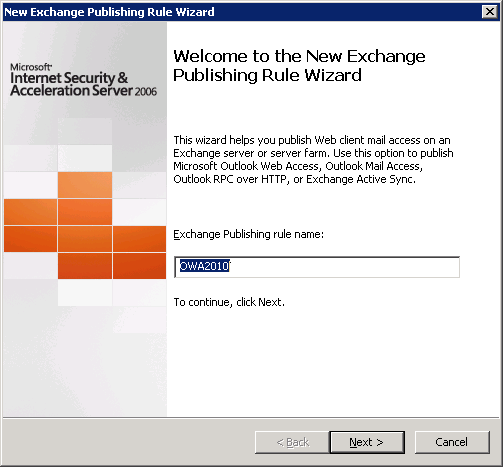](images/1-new-rule-owa.png) [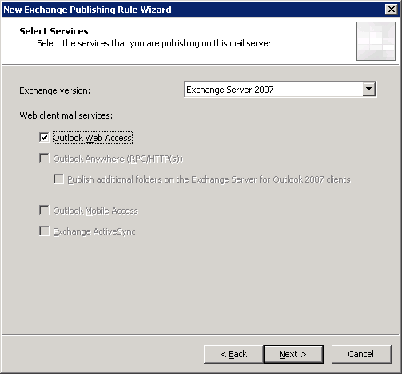](images/2-rule-owa.png)

\- Notice ISA 2006 does not provide a wizard (or the new form) for OWA 2010 - for that you need TMG

[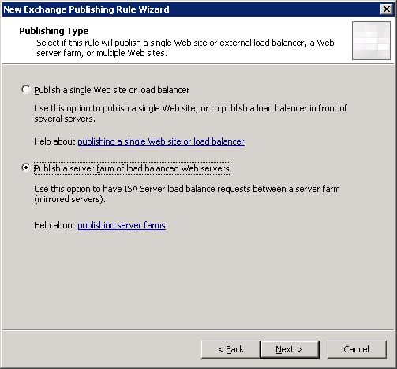](images/3-farm-publish.png) [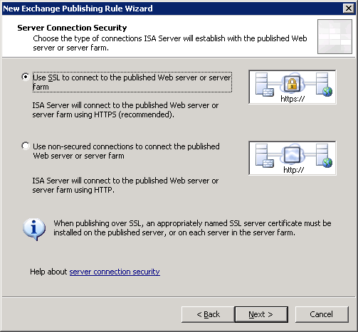](images/4-bridge-options-to-cas-servers.png)

[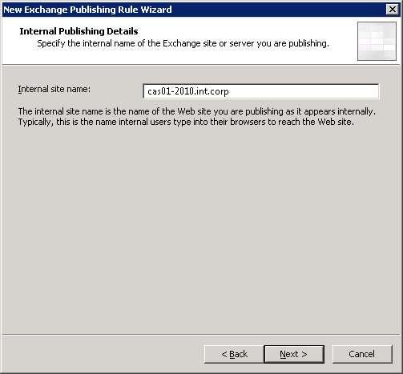](images/5-to-farm-2010.png)

\- Now we need to create the Web Farm and select it as the target for the publishing rule

[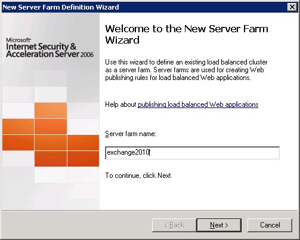](images/6-newfarm.png) [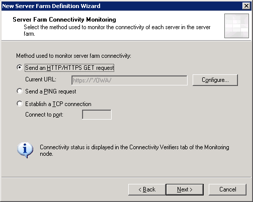](images/7-farm-connectivity-verification.png)

 [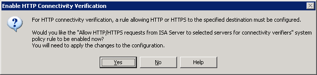](images/8-confirm-isa-system-rule-for-verification.png)[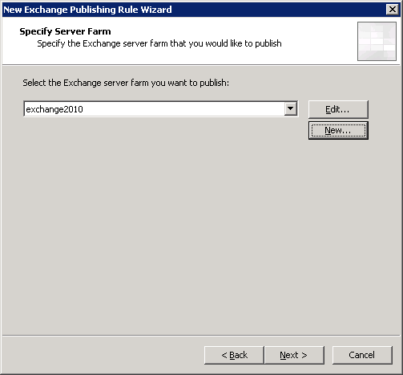](images/9-select-the-farm.png)

\- Configure the web listener and authentication delegation option

\- The web listener should be already configured for Form Authentication and a valid SSL certificate

[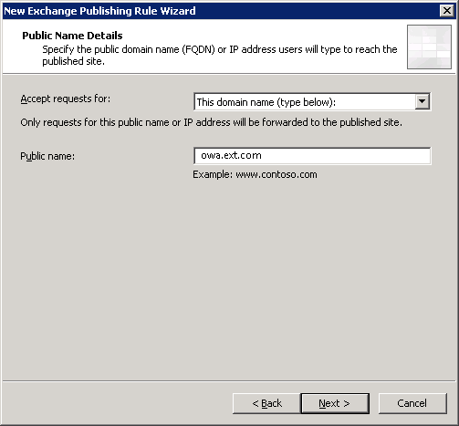](images/10-public-name-for-rule.png) [")](images/11-listerner.png)

[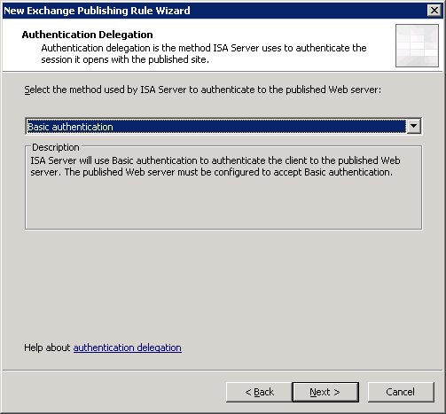](images/12-delegation.png) [")](images/13-user-sets.png)

\- The publishing rule for the Web Farm is now complete.

\- Two additional configurations are now required:

1. Edit the new "exchange2010" Rule: **Remove** the legacy virtual directory's - /Exchange, /Exchweb and /Public they will continue to be published to your original 2003 rule. **Add** /ecp/\* as this is the new "options" applications for users, and a powerful administration web console with Exchange 2010. [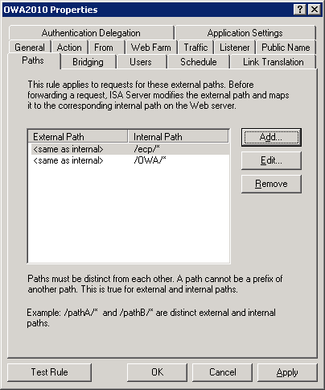](images/14-edit-owa-rule.png)
2. Edit the original OWA 2003 publishing rule and remove Microsoft-Server-ActiveSync path, we will next create ActiveSync publishing rule for Exchange 2010. [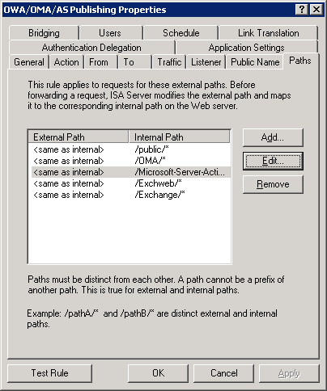](images/15-edit-owa-2003-rule.png)

Now we have three last steps to finish our Exchange 2010 publishing:

1. Create a new Exchange Web Client Access rule - and select ActiveSync - Repeat most of part 1 except we select ActiveSync, publish the webfarm, enter the same info, and select the same listener.
2. Now as same for ActiveSync, we need to move the RPCoverHTTP (Outlook Anywhere) from the 2003 publishing rule to 2010 publishing rule. Delete the existing rule. Next you we will create a new publishing rule for Outlook Anywhere based on Exchange 2010.
3. Create a new Exchange Web Client Access rule - and select Outlook Anywhere - Repeat most of part 1 except we select Outlook Anywhere, publish the webfarm, enter the same info, and select the same listener.

That's it :)

if you kept up with all the requirements, all should be fine and you are now able to migrate your 2003 users to 2010 with ease, while both systems are allowed for external connectivity.

Enjoy!

More relevant links on the subject:

[Upgrading Outlook Web App to Exchange 2010](http://msexchangeteam.com/archive/2009/12/02/453367.aspx)

[Transitioning Client Access to Exchange Server 2010](http://msexchangeteam.com/archive/2009/11/20/453272.aspx)
