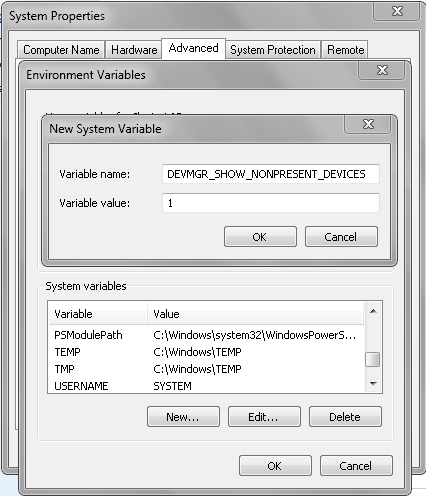
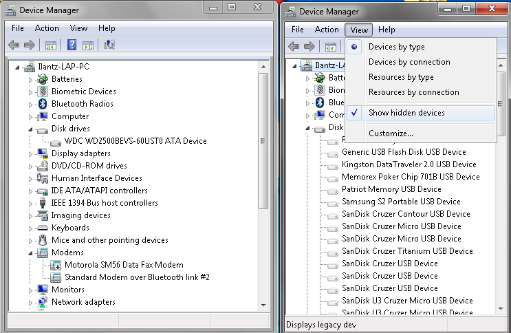


So you've plugged a harddrive / disk-on-key or any other hot plugged device, and oops BSOD :(


or, you want to install a new driver for a device that you have removed, but windows magic plug-and-play installed the driver automatically.... but you don't want that do you ?

Anyway there's an old method that works great.

You open device management, and click , view "show hidden devices"... but you **fail** to see your disconnected devices...

FIX - Show **all** disconnected devices, open System Properties, click Environment Variables and click to add a New System Variable.

After this you will be able to launch Device Manager again and when you'll click to Show Hidden Devices, you **will** see all those removed or disconnected device drivers !

That's it ! Enjoy
