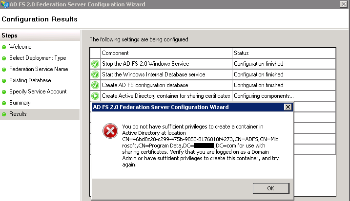
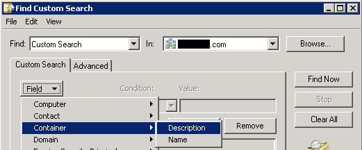
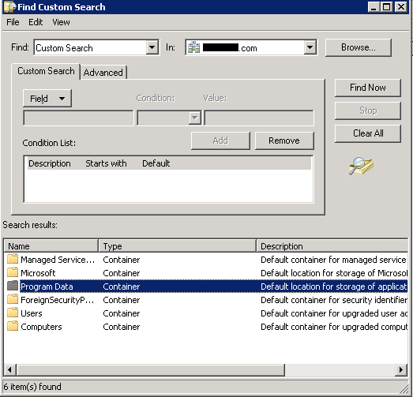
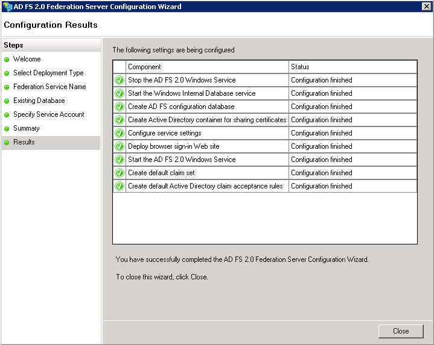

Hi Again,


I've encountered a funny situation the other day with a new Office 365 hybrid deployment with an initial install of ADFS 2.0 for Federation with Office 365 and SSO.


The first attempt of running the "AD FS 2.0 Federation Server Configuration Wizard" ended with a failure:

> You do not have sufficient privileges to create a container in Active Directory at location CN=46bd8c28-c299-475b-9853-8176010f4273,CN=ADFS,CN=Microsoft,CN=Program Data,DC=Domain,DC=com for use with sharing certificates. Verify that you are logged on as a Domain Admin or have sufficient privileges to create this container, and try again.

Well, I've double checked my logged on user credentials, the built-in Administrator - we have all the required permissions. I've opened ADSIedit and looked for the Program Data container under the domain partition, just to make sure no permissions issues are indeed preventing this wizard to complete.

Guess what - **no Program Data container !!?**

I had the feeling that the container was moved rather then deleted or removed completely.. so I decided made a little search, a custom search for containers with a description starting with the string "default"

Found it (!) and moved it to the root of the Domain tree, then I've started the the ADFS configuration wizard again.

Case closed :) happy ADFS and a working federation with Office 365
