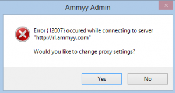
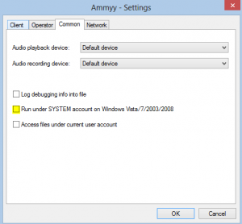

Hi again,


I've been using [Ammyy Admin](http://www.ammyy.com "Ammyy Admin") to support family members and friends for a while now, but since I've upgraded to Windows 8, the program seems to fail it's initial connection to it's public servers upon start up.


It keeps popping out an error window:

> Error {12007} occured while connecting to server "http://rl.ammyy.com" Would you like to change proxy settings?

To solve this, just open the Ammyy Admin setting menu and un-check the "Run under SYSTEM account on Windows Vista/7/2003/2008" check-box.

hope you find this useful.
