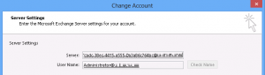
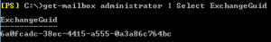

Hello all,


On Monday, January 14th I've attended our local Unified Communications User Group at Microsoft and presented the upcoming changes and enhancements with Exchange 2013 HA and Site Resilience capabilities. This post is a follow up on some of the topics I've covered.


Exchange 2013 simplifies deployments and operations greatly with a load of new features. One of the notable changes on my part is the server name no longer reflects a server name. In Exchange 2003,2007 the RPC endpoint used to be our actual server host-name or the clustered mailbox group name. With Exchange 2010 we had the CAS Array which was a logical name that enabled us to load balance CAS servers. traditional single Exchange 2010 host-name was also a possibility.

With Exchange 2013 "Outlook clients no longer connect to a server fully qualified domain name (FQDN) as they’ve done in all previous versions of Exchange. Using Autodiscover, Outlook finds a new connection point made up of the user’s mailbox GUID + @ + the domain portion of the user’s primary SMTP address. This change makes it much less likely that users will see the dreaded message “Your administrator has made a change to your mailbox. Please restart.”. Only Outlook 2007 and later versions are supported with Exchange 2013" (Taken from the Exchange 2013 help file - page 46 - Client Access Server" See for your self:

So without a namespace dependency ( server name or a CAS array) that affects our site resilience procedure or fail-over things gets easy - our Mailbox GUID will always remains intact no matter which server is running. Moreover, Exchange 2013 now **restricts** all client traffic to HTTP using the RPC over HTTP component and relies on the infamous AutoDiscover mechanism to supply the client with the correct HTTP proxy server to use, that's why outlook 2003 is no longer supported... Just to be clear here, this means that all Outlook clients will use "Outlook Anywhere" within the internal network and outside it, if allowed of course. It is also worth mentioning that it is now possible to have a single "global" host name for internal clients using Outlook, Outlook Web App, ActiveSync, EWS etc.

Okay, great! But who does DNS has to with anything? Well, due to the changes within the product with Exchange 2013, DNS Round Robin is a great option for redundancy and will allow you to maintain it without any special requirements for external load balancers or WNLB for example. Although its a great option - it does not mean that load balances are not. DNS is not aware of server health, availability or server load which is just one of the attributes of a typical load balancer product.

A quick recap on DNS Round Robin for those who are not familiar with it, its basically a single DNS host name record which resolves to multiple IP's, where the first result will be randomized each time a client will query the DNS server. For example , within the DNS zone of the ilantz.com domain two records exist and this is the answer for the first query:

Mail = 192.168.100.1 Mail = 192.168.200.1

While performing the query once again, the results change:

Mail = 192.168.200.1 Mail = 192.168.100.1

In my example the host name mail.ilantz.com will be configured within Exchange as the Outlook Anywhere proxy server for internal and also external access. Each server will be located in a different geographic site, which correlates to its subnet. 192.168.100.0/24 is the active HQ site and 192.168.200.0/24 is the passive DR site.

Now, this should rise a relevant question within your mind... How exactly would a client know to which proxy server he should connect to? You would not want your VIP users connecting to the DR site which is 1000km away right? To resolve this issues you will need a DNS solution that is referred as GeoDNS or Netmask Ordering (in Microsoft). The builtin mechanism within a Windows server DNS will allow you to use subnet masking to determine the closest IP it should return as the first answer. This is also a default behavior with Windows 7 and above.

While determining the closest result based on the binary bits might work for some customers, for most "complex" networks it will not... So here's some points to consider when you implement DNS round robin with your Exchange 2013 namespace:

- Your current internal and external DNS solution supports your requirements for result prioritization.
- Make sure your Exchange topology will reflect your desired results
- Don't confuse external load balances capabilities with DNS round robin

Here's some excellent additional reading links, specifically the first post from the Networking team blog.

Hope this clears some confusion, Ilantz

[DNS Round Robin and Destination IP address selection](http://blogs.technet.com/b/networking/archive/2009/04/17/dns-round-robin-and-destination-ip-address-selection.aspx) [Windows Vista and Windows Server 2008 DNS clients do not honor DNS round robin by default](http://support.microsoft.com/default.aspx?scid=kb;EN-US;968920) [Prioritizing local subnets](http://technet.microsoft.com/en-us/library/cc787373\(v=ws.10\).aspx) [Description of the netmask ordering feature and the round robin feature in Windows Server 2003 DNS](http://support.microsoft.com/kb/842197)
