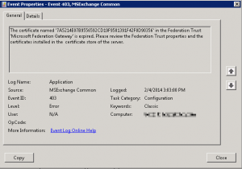

Hi Again,


While setting up the Hybrid Configuration Wizard on an Exchange 2010 server for Office 365, I've encountered this error: `[2/4/2014 13:36:8] INFO:Running command: Get-FederationInformation -DomainName 'contoso.mail.onmicrosoft.com' -BypassAdditionalDomainValidation 'True' [2/4/2014 13:36:8] INFO:Cmdlet: Get-FederationInformation --Start Time: 2/4/2014 3:36:08 PM. [2/4/2014 13:36:16] INFO:Cmdlet: Get-FederationInformation --End Time: 2/4/2014 3:36:16 PM. [2/4/2014 13:36:16] INFO:Cmdlet: Get-FederationInformation --Processing Time: 7690.8. [2/4/2014 13:36:16] INFO:Disconnected from On-Premises session [2/4/2014 13:36:17] INFO:Disconnected from Tenant session [2/4/2014 13:36:17] ERROR:Updating hybrid configuration failed with error 'Subtask Configure execution failed: Creating Organization Relationships.` `Execution of the Get-FederationInformation cmdlet had thrown an exception. This may indicate invalid parameters in your Hybrid Configuration settings.` ``Operation is not valid due to the current state of the object. at System.Management.Automation.PowerShell.CoreInvoke[TOutput](IEnumerable input, PSDataCollection`1 output, PSInvocationSettings settings) at System.Management.Automation.PowerShell.Invoke(IEnumerable input, PSInvocationSettings settings) at System.Management.Automation.PowerShell.Invoke() at Microsoft.Exchange.Management.Hybrid.RemotePowershellSession.RunCommand(String cmdlet, Dictionary`2 parameters, Boolean ignoreNotFoundErrors) '.`` `Additional troubleshooting information is available in the Update-HybridConfiguration log file located at C:\Program Files\Microsoft\Exchange Server\V14\Logging\Update-HybridConfiguration\HybridConfiguration_2_4_2014_13_35_39_635271177398297855.log.`


Looking at the application log in the Exchange server showed an Event ID 403 with source MSExchange Common: [](images/Event-ID-403-MSExchange-Common.png)

```text
The Certificate named xxxxxxx in the Federation Trust 'Microsoft Federation Gateway' is expired. Please review the Federation Trust properties and the certificates installed in the certificate store of the server.
```

After checking of course, the Federation certificate was just created... and is indeed valid.....

All that was required was a quick "restart" to the application pools on the server, I usually just restart the MSExchangeServiceHost and MSExchangeProtectedServiceHost services. after that the wizard completed successfully :)

Hope this helped anyone,
