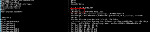

Just ran into this one,


An existing Exchange 2013 CU2 installation was requested to be updated to CU5, nothing special there...


Once trying to run the CU5 setup.exe /PrepareAD , the setup failed with an error: `[02/07/2014 11:57:49.0192] [1] [ERROR] Active Directory operation failed on dc.domain.com. The object 'CN=Default,CN=OWA Mailbox Policies,CN=Exchange,CN=Microsoft Exchange,CN=Services,CN=Configuration,DC=domain,DC=com' already exists. [02/07/2014 11:57:49.0192] [1] [ERROR] The object exists.`

Digging in the ExchangeSetup.log file, I've tried to identify the cause.

```powershell
[02/07/2014 11:57:49.0192] [1] [ERROR] The following error was generated when "$error.Clear(); $policyDefault = Get-OwaMailboxPolicy -DomainController $RoleDomainController | where {$_.Identity -eq "Default"};
```

```powershell
if($policyDefault -eq $null) { New-OwaMailboxPolicy -Name "Default" -DomainController $RoleDomainController } " was run: "Microsoft.Exchange.Data.Directory.ADObjectAlreadyExistsException: Active Directory operation failed on dc.domain.com. The object 'CN=Default,CN=OWA Mailbox Policies,CN=Exchange,CN=Microsoft Exchange,CN=Services,CN=Configuration,DC=domain,DC=com' already exists. ---> System.DirectoryServices.Protocols.DirectoryOperationException: The object exists.
```

So I've tried to reproduce the test manually using the same command in the setup: `Get-OwaMailboxPolicy -DomainController $RoleDomainController | where {$_.Identity -eq "Default"}` And the result was indeed $null .. which made no sense here... because it does exists, as the error states - **the object 'CN=Default,CN=OWA Mailbox Policies,CN=Exchange,CN=Microsoft Exchange,CN=Services,CN=Configuration,DC=domain,DC=com' already exists.**

Then I've noticed that the CN was "default" with lower "d" ... although the Where-Object and -eq should be case insensitive, the check failed...

[](images/get-owamailboxpolicy-before.png)

So, I've modified the value to be "Default" with capital "D":

```powershell
Set-OwaMailboxPolicy -Identity default -Name Default
```

[](images/get-owamailboxpolicy-after.png)

that did the trick :) and the setup.exe /PrepareAD was successful.
